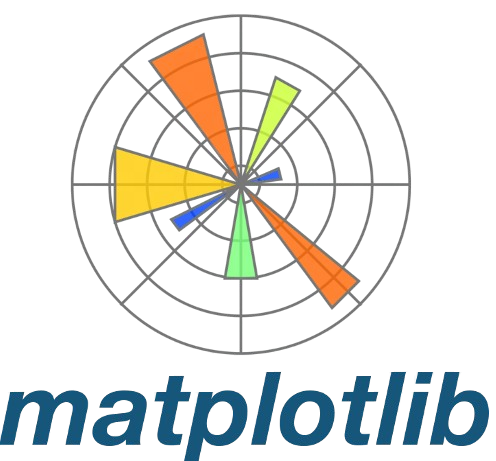
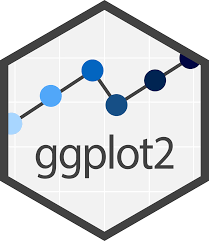

# **Exploratory Data Analysis & Unsupervised Learning**

<a href="https://hassothea.github.io/">Lecturer: HAS Sothea, PhD</a>

- [👋 Introduction](#-introduction)
- [📝 Course Criteria](#-course-criteria)
  - [⌨️ Programming:](#️-programming)
- [📋 Course session](#-course-session)
- [📋 Midterms, Exams and Projects](#-midterms-exams-and-projects)
  - [✏️ Project:](#️-project)
- [📚 Resources and Further Reading](#-resources-and-further-reading)

# 👋 Introduction

Welcome to the practical session webpage on **Exploratory Data Analysis
(EDA) & Unsupervised Learning**! This session is designed to equip you
with the essential skills and techniques to explore and understand your
data before diving into more complex modeling tasks. By the end of this
session, you will be adept at uncovering crucial insights hidden within
the data and leveraging this knowledge to guide your analysis
effectively. You will approach data analysis with a clear objective,
applying a variety of techniques to understand, interpret, and make
informed decisions based on the data. Additionally, you will be able to
present your findings visually, making them accessible for both
technical and general audiences.

------------------------------------------------------------------------

# 📝 Course Criteria

| **`Criteria`**               | **`Percentage`** |
|:-----------------------------|:----------------:|
| Attendance                   |       10%        |
| Participation & quiz         |       30%        |
| Midterm Exam or/and Project  |     15%+15%      |
| Final Project & Presentation |       30%        |

## ⌨️ Programming:

> You are free you use your favorite programming language
> <a href="https://www.python.org/" target="_blank"> src="./img/python.png" style="position: relative; bottom: 0px"
> width="30" /></a> `Python` or
> <a href="https://www.r-project.org/" target="_blank"> src="./img/R_logo.png" style="position: relative; bottom: 0px"
> width="30" /></a>…

## `Python`

- <a href="https://docs.jupyter.org/en/latest/" target="_blank"> Jupyter Notebook</a>
- 
- <a href="https://matplotlib.org/" target="_blank"> Matplotlib</a>
- <a href="https://seaborn.pydata.org/" target="_blank"> Seaborn</a>

## `R`

- <a href="https://quarto.org/" target="_blank"> Rmarkdown/Quarto</a>
- <a href="https://ggplot2.tidyverse.org/" target="_blank"> Posit cloud</a>
- <a href="https://ggplot2.tidyverse.org/" target="_blank"> Ggplot2</a>
- <a href="https://www.tidyverse.org/" target="_blank"> Tidyverse</a>

------------------------------------------------------------------------

# 📋 Course session

> **Visit the course webpage:** <a href="https://hassothea.github.io/M1_EDA_ITC/" target="_blank">M1-DAS: EDA & Unsupervised Learning</a>

# 📋 Midterms, Exams and Projects

In this section, you will find all the information related to the
midterms, exams and projects including instructions, starting dates and
the deadlines.

## ✏️ Project:

- Deadline for the report: `...Loading`.
- Where to submit: `...Loading`
- Your report should be in (your favorite) **PDF** format and include
  the following criteria:
  - **Members’ names & contributions**.
    - Clearly state each member’s contribution to the report.
    - For example:
      - **Luffy**: Introduction, Data Preprocessing
      - **Gojo**: Exploratory Data Analysis, Model Development
      - **Naruto**: Results and Evaluation, Conclusion
  - **Introduction**:
    - Clearly state the objectives and purpose of the analysis.
    - Provide a brief descriptive statistics of the dataset.
  - **Data Preprocessing**:
    - Detail steps taken to clean and preprocess the data.
    - Explain handling of missing values and outliers.
    - Describe any feature engineering techniques applied.
  - **Exploratory Data Analysis (EDA)**:
    - Include visualizations (charts, graphs) and descriptive
      statistics.
    - Identify key patterns, trends, and anomalies in the data.
  - **Unsupervised/supervised Tasks**:
    - Exploring structures or connections of the data according the flow
      of your analysis.
    - Provide details on clustering methods or model training,
      validation, and testing processes.
    - Include any choice of parameters of unsupervised tasks or
      hyperparameter tuning and model optimizations.
  - **Results and Evaluation**:
    - Present the resulting performance (e.g., obtained structures or
      accuracy, precision, recall, F1-score, RMSE).
    - Compare performance across different methods if multiple were
      used.
    - Highlight any insights or conclusions drawn from the implemented
      methods/models.
  - **Conclusion**:
    - Summarize key findings and their implications.
    - Discuss any limitations of the analysis.
    - Suggest potential areas for future research or improvement.
  - **References**:
    - Cite all sources of data and any external libraries or tools used.
    - Include academic references for any theoretical concepts or
      methods applied.
  - **Appendix (Optional)**:
    - Provide additional figures, tables, or code snippets that support
      the analysis.
- **Presentation**:
  - A possible dates: `...Loading`.

------------------------------------------------------------------------

# 📚 Resources and Further Reading

Here, you will find additional resources, including books, research
papers, and online courses, to further your understanding of
**Exploratory Data Analysis and Unsupervised Learning**.

👉 You will find these books/links helpful…

- <a
  href="https://github.com/PacktPublishing/Exploratory-Data-Analysis-with-Python-Cookbook?tab=readme-ov-file"
  target="_blank">Exploratory-Data-Analysis-with-Python-Cookbook</a>

- <a href="https://haralick.org/DV/Handbook_of_Data_Visualization.pdf"
  target="_blank">Handbook of Data Visualization, Chen et al.</a>

- <a href="https://wesmckinney.com/book/" target="_blank">Python for Data
  Analysis, Wes M.</a>

- <a href="https://bookdown.org/rdpeng/exdata/"
  target="_blank">Exploratory Data Analysis with R, Roger D. Peng</a>

- <a
  href="https://batrachos.com/sites/default/files/pictures/Books/Wickham_Grolemund_2017_R%20for%20Data%20Science.pdf"
  target="_blank">R for Data Science, Hadley W. and Garrett G.</a>

------------------------------------------------------------------------

